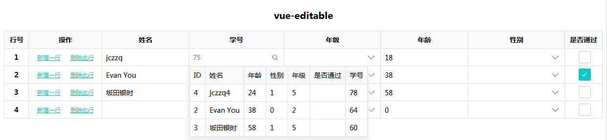

# mone-editable
基于vue的可编辑表格插件


## 功能
`mone-editable`支持的表单类型有：
- `KCheckBox` 单选框，类似于input type="radio"
- `KNumber` 数字框，类似于input type="number"
- `KSelect` 下拉框，类似于select
- `KQuery` 搜索框，自定义表单类型，常用于异步关联查询
- `KText` 文本框，类似于input type="text"

简约的样式风格

## 使用
#### 安装组件
``` bash
npm i mone-editable -S
```
#### 引入和使用
`index.js`
```
import Vue from 'vue';
import App from './App';

import 'mone-editable/dist/mone-editable.css';
import KE from 'mone-editable';
Vue.use(KE);

/* eslint-disable no-new */
new Vue({
  el: '#app',
  render: h => h(App)
});

```
`App.vue`
```
<template>
  <div id="app">
    <h3 class="text-center">mone-editable</h3>
    <!-- 可编辑表格 -->
    <k-editable :config="config"
      :data-list="rows"
      @add-row="addNewRow"
      @del-row="delRow"></k-editable>
  </div>
</template>

<script>
export default {
  name: 'app',
  data() {
    return {
      cols: [2, 2, 2, 4, 1],
      rowModel: {
        id: null,
        name: null,
        age: null,
        gender: null,
        grade: null,
        No: null
      },
      config: {
        fields: [
          { id: 5, name: 'id', label: 'ID' },
          { id: 1, name: 'name', label: '姓名', type: 'KText' },
          { id: 4, name: 'age', label: '年龄', type: 'KNumber' },
          { id: 6, name: 'gender', label: '性别', type: 'KSelect' },
          { id: 7, name: 'hasPass', label: '是否通过', type: 'KCheckBox' },
          { id: 3, name: 'grade', label: '年级', type: 'KSelect' },
          { id: 2, name: 'No', label: '学号', type: 'KQuery' }
        ],
        list: {
          grade: '一年级|1,二年级|2,三年级|3,四年级|4,五年级|5,六年级|6',
          gender: '男|1,女|0'
        },
        table: {
          No: {
            fields: [
              { name: 'id', label: 'ID', type: 'string' },
              { name: 'name', label: '姓名', type: 'string' },
              { name: 'age', label: '年龄', type: 'number' },
              { name: 'gender', label: '性别', type: 'number' },
              { name: 'grade', label: '年级', type: 'number' },
              { name: 'hasPass', label: '是否通过', type: 'boolean' },
              { name: 'No', label: '学号', type: 'number' }
            ],
            dataList: [
              {
                id: 4,
                name: 'jczzq4',
                age: 24,
                gender: 1,
                grade: 5,
                No: 78
              },
              {
                id: 2,
                name: 'Evan You',
                age: 38,
                gender: 0,
                grade: '2',
                No: 64
              },
              {
                id: 3,
                name: '坂田银时',
                age: 58,
                gender: 1,
                grade: 5,
                No: 60
              }
            ]
          }
        },
        query: {},
        primaryKey: 'No',
        searchKey: 'name',
        hideFields: 'id'
      },
      rows: [
        {
          id: 1,
          name: 'jczzq',
          age: 18,
          gender: 0,
          grade: 4,
          No: 75,
          hasPass: false
        },
        {
          id: 2,
          name: 'Evan You',
          age: 38,
          gender: 0,
          grade: '2',
          No: 64,
          hasPass: true
        },
        {
          id: 3,
          name: '坂田银时',
          age: 58,
          gender: 1,
          grade: 5,
          No: 60,
          hasPass: false
        }
      ]
    };
  },
  methods: {
    // 添加新行
    addNewRow(rowIndex) {
      let newRow = JSON.parse(JSON.stringify(this.rowModel));
      for (var key in newRow) {
        newRow[key] = '';
      }
      // 模拟主键
      newRow[this.config.primaryKey] = Date.now();
      this.rows.splice(rowIndex + 1, 0, newRow);
    },
    // 删除某行
    delRow(rowIndex) {
      this.rows.splice(rowIndex, 1);
    }
  }
};
</script>

<style lang="less">
.table-block {
  border: 1px solid blue;
}
.table-block > div {
  border: 1px solid red;
  box-sizing: border-box;
  .cell {
    border: 1px solid red;
    box-sizing: border-box;
  }
}
</style>
```
通过`config`参数配置整个editable的主结构，
通过`data-list`参数展示列表数据，数据的编辑改动直接影响到该引用参数

## 目录
- assets 文档以及项目相关资源
- example 示例程序开发目录
- lib 压缩打包后的正式文件
- src 插件源码

## 开发
``` bash
# 安装依赖
npm install

# 查看项目 http://localhost:8080
npm run dev
```
开发时会启动`example`目录的示例程序

## 构建

``` bash
# 构建正式文件到 lib 目录
npm run build

# 查看webpack构建分析
npm run build --report
```

## 贡献人员
[jczzq](https://github.com/jczzq)
